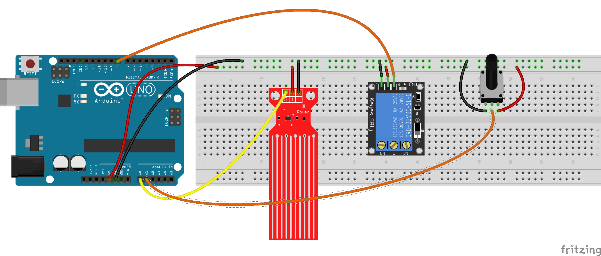

# Taller Introducción a la Domótica

## Objetivos

* Entender qué es la domótica
* Usos de la domótica
* Conocer algunas instalaciones domóticas

## Contenidos

Trabajaremos en implementar una casa domótica conectada con los siguientes elementos

* Medida de la temperatura y humedad interna
* Control y regulación de temperatura y humedad
* Control de riego
* Control de iluminación

## Público

Tres grupos diferenciados. Se harán grupos con un  máximo 15 alumnos por grupo:

- Infantil y 1er  ciclo de Primaria (3-7 años).
- 2º ciclo de Primara y 1er ciclo de la ESO (8-13 años).
- 2º ciclo de ESO y  Bachillerato (14-18 años).

## Actividades

### Infantil y 1er  ciclo de Primaria (3-7 años). Duración: Una sesión de 1 hora

* ¿Qué es la domótica?
* ¿Qué usos se te ocurren?
* Ejemplo de sistema de riego

### 2º ciclo de Primara y 1er ciclo de la ESO (8-13 años). 2 sesiones de 1 hora

#### Sesión 1:

* Qué es la domótica
* ¿Qué usos se te ocurren?
* Montaje de un sistema de riego

#### Sesión 2:

* Programación del sistema de riego
* Pruebas del sistema

### 2º ciclo de ESO y  Bachillerato (14-18 años). Duración: 2 sesiones de 1.5 horas

#### Sesión 1:

* Qué es la domótica
* ¿Qué usos se te ocurren?
* Montaje de un sistema de riego
* Primera programación del sistema de riego

#### Sesión 2:

* Montaje de un sistema de iluminación automática
* Programación del sistema
* Pruebas del sistema 

### Materiales

* Kit de Arduino
* Ordenadores/tablets (se podrían usar las Raspberry)
