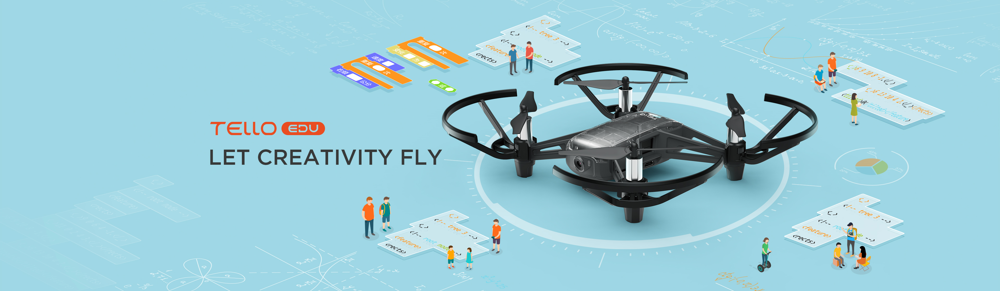

# Taller Introducción a los Drones

## Objetivos

* Entender qué es un dron
* Usos de los drones
* Conocer los componentes de los drones
* Control remoto de drones
* Programación de drones

## Contenidos

* ¿Qué es un dron?
* Regulación del uso de los drones
* Estructura y componetnes de los drones
* Control de los drones
* Programación de drones

## Público

Tres grupos diferenciados. Se harán grupos con un  máximo 15 alumnos por grupo:

- Infantil y 1er  ciclo de Primaria (3-7 años).
- 2º ciclo de Primara y 1er ciclo de la ESO (8-13 años).
- 2º ciclo de ESO y  Bachillerato (14-18 años).

## Actividades

### Infantil y 1er  ciclo de Primaria (3-7 años). Duración: Una sesión de 1 hora

* ¿Qué es un dron?
* ¿Qué usos se te ocurren?
* Ejemplo de control de dron

### 2º ciclo de Primara y 1er ciclo de la ESO (8-13 años). 2 sesiones de 1 hora

#### Sesión 1:

* ¿Qué es un dron?
* Usos de drones
* Estructura de un drone
* Control remoto de un dron

#### Sesión 2:

* Programación de un dron
* Pruebas de la programación

### 2º ciclo de ESO y  Bachillerato (14-18 años). Duración: 2 sesiones de 1.5 horas

#### Sesión 1:

* ¿Qué es un dron?
* Usos de drones
* Estructura de un drone
* Control remoto de un dron
* Programación de un dron

#### Sesión 2:

* Programación avanzada
* Pruebas de la programación

### Materiales

* Drones Trello EDU
* Ordenadores/tablets (se podrían usar las Raspberry)

