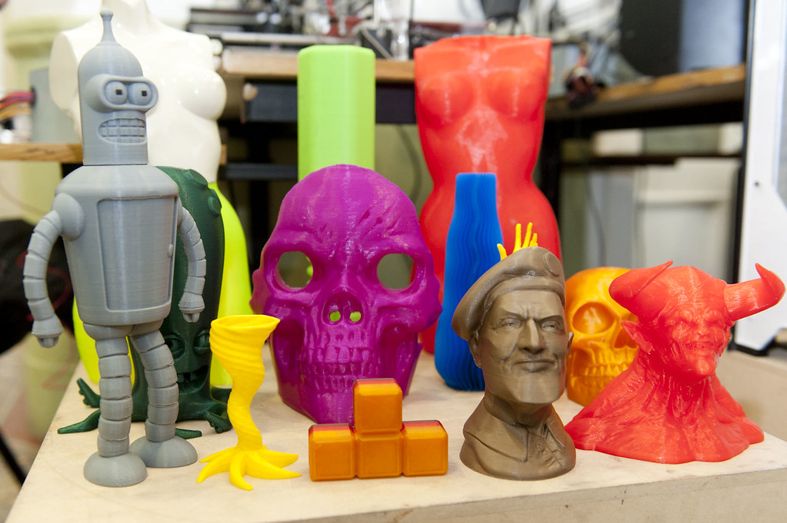

# Taller Introducción a la Impresion y al Diseño 3D

## Objetivos

* Conocer las posibilidades y capacidades del diseño e impresión en 3D.
* Aprender a diseñar modelos sencillos en 3D.
* Aprender las técnicas de impresión 3D básicas.
* Conocer y utilizar el software para modelar objetos sencillos y su posterior impresión.

## Contenidos

* ¿En qué consiste la impresión 3D?
* ¿Qué tipo de objetos podemos imprimir?
* Proceso de impresión 3D
* Programa de diseño 3D: Tinkercad

## Público

Tres grupos diferenciados. Se harán grupos con un  máximo 15 alumnos por grupo:

- Infantil y 1er  ciclo de Primaria (3-7 años).
- 2º ciclo de Primara y 1er ciclo de la ESO (8-13 años).
- 2º ciclo de ESO y  Bachillerato (14-18 años).

## Actividades

### Infantil y 1er  ciclo de Primaria (3-7 años). Duración: 1 sesión de 1 hora

* Ver y tocar piezas impresas en 3D
* Ver cómo se diseña un llavero
* Ver el Funcionamiento de las Impresoras 3D

### 2º ciclo de Primara y 1er ciclo de la ESO (8-13 años). 2 sesiones de 1 hora

#### Sesión 1:

* ¿Qué son las impresoras 3D?
* Piezas impresas
* Búsqueda de modelos 3D
* ¿Cómo se imprimiría?
* Impresoras 3D en funcionamiento

#### Sesión 2

* Diseño 3D: Tinkercad

### 2º ciclo de ESO y  Bachillerato (14-18 años). Duración: 2 sesiones de 1.5 horas.

#### Sesión 1:

* ¿Qué son las impresoras 3D?
* Piezas impresas
* Búsqueda de modelos 3D
* ¿Cómo se imprimiría?
* Impresoras 3D en funcionamiento

#### Sesión 2

* Diseño 3D: Tinkercad
* Otros programas de diseño

## Materiales

* Impresoras 3D
* Filamento
* Piezas impresas
* Ordenadores/tablets (se podrían usar las Raspberry)
