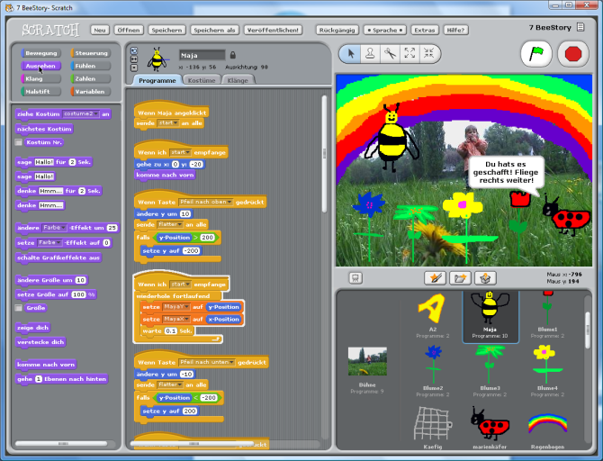

# Taller Introducción a la Programación

## Objetivos

* Entender el concepto de programación
* Conocer herramientas de programación bloques
* Conocer Scratch
* Saber buscar ejemplos en Scratch
* Aprender a hacer programas sencillos

## Contenidos

* ¿Qué es programar?
* Programación con bloques
* Uso de Scratch
* Ejemplo sencillo de programa con Scratch

## Público

Tres grupos diferenciados. Se harán grupos con un  máximo 15 alumnos por grupo:

- Infantil y 1er  ciclo de Primaria (3-7 años).
- 2º ciclo de Primara y 1er ciclo de la ESO (8-13 años).
- 2º ciclo de ESO y  Bachillerato (14-18 años).

## Actividades

### Infantil y 1er  ciclo de Primaria (3-7 años). Duración: 1 sesión de 1 hora

* ¿Qué es programar?
* Programación con bloques: Code.org
* Jugando con Scratch

### 2º ciclo de Primara y 1er ciclo de la ESO (8-13 años). 2 sesiones de 1 hora

#### Sesión 1:

* ¿Qué es programar?
* Programación con bloques
* Usando ejemplos de Scratch

#### Sesión 2:

* Programando con Scratch
* Programando juegos sencillos

### 2º ciclo de ESO y  Bachillerato (14-18 años). Duración: 2 sesiones de 1.5 horas

#### Sesión 1:

* ¿Qué es programar?
* Programación con bloques
* Usando ejemplos de Scratch
* Programando con Scratch

#### Sesión 2:

* Programando juegos con Scratch

## Materiales

* Ordenadores/tablets (se podrían usar las Raspberry)
