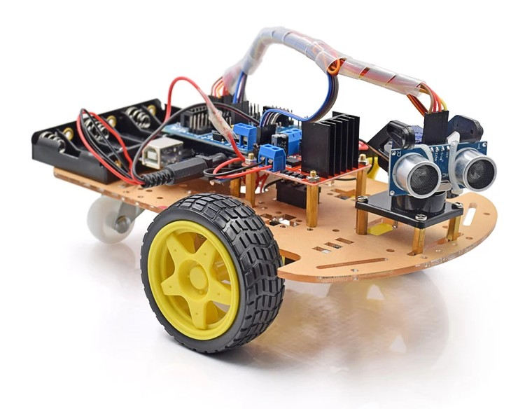
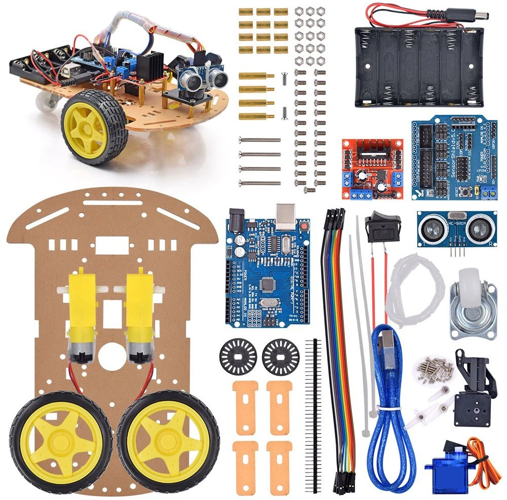

# Taller Introducción a la Robótica

## Objetivos

* Conocer las posibilidades de la  robótica
* Conocer los diferentes tipos de robots

## Contenidos

* ¿Qué es un robot?
* Conocer los diferentes usos de los robots
* Aprender los diferentes componentes de los robots
* ¿Cómo se programa un robot?

## Público

Tres grupos diferenciados. Se harán grupos con un  máximo 15 alumnos por grupo:

- Infantil y 1er  ciclo de Primaria (3-7 años).
- 2º ciclo de Primara y 1er ciclo de la ESO (8-13 años).
- 2º ciclo de ESO y  Bachillerato (14-18 años).

## Actividades

### Infantil y 1er  ciclo de Primaria (3-7 años). Duración: 1 sesión de 1 hora

* ¿Qué es un robot?
* ¿Hay robots a nuestro alrededor?
* ¿Cómo funciona un robot?
* Idendificar las partes de un robot

### 2º ciclo de Primara y 1er ciclo de la ESO (8-13 años). Duración: 2 sesiones de 1 hora

#### Sesión 1:

* ¿Qué es un robot?
* ¿Cómo funciona un robot?
* Montaje de un robot sencillo
* ¿Cómo se programa un robot?

#### Sesión 2:

* Programación de un robot
* Pruebas de funcionamiento del robot

### 2º ciclo de ESO y  Bachillerato (14-18 años). Duración: 2 sesiones de 1.5 horas

#### Sesión 1:

* ¿Qué es un robot?
* ¿Cómo funciona un robot?
* Montaje de un robot sencillo
* Programación de robots

#### Sesión 2:

* Programación avanzada
* Pruebas de funcionamiento del robot

## Materiales

* Kit de arduino
* [Kit para robot](https://es.aliexpress.com/item/32541422454.html)

* Ordenadores/tablets (se podrían usar las Raspberry)

