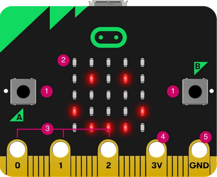

# Taller Introducción a los Drones

## Objetivos

* Conocer micro:bit
* Aprender a programar micro:bit
* Realizar montajes sencillos con micro:bit

## Contenidos

* ¿Qué es micro:bit? Características
* Programar microbit con bloques y python
* Realizar montajes sencillos

## Público

Tres grupos diferenciados. Se harán grupos con un  máximo 15 alumnos por grupo:

- Infantil y 1er  ciclo de Primaria (3-7 años).
- 2º ciclo de Primara y 1er ciclo de la ESO (8-13 años).
- 2º ciclo de ESO y  Bachillerato (14-18 años).

## Actividades

### Infantil y 1er  ciclo de Primaria (3-7 años). Duración: 1 sesión de 1 hora

1. Jugando con microbit

### 2º ciclo de Primara y 1er ciclo de la ESO (8-13 años). 4 sesiones de 1 hora

Programación con bloques

1. Emulador: caritas y botones
1. micro:bit: Caritas, botones y dado
1. micro:bit sensores: temperatura y luz
1. micro:bit conductividad:  agua y materiales
1. Comunicación Radio
1. Luz del frigorífico con 2 micro:bit
1. Medida de temperatura con sensores
1. Eficacia de un termo vs botella
1. Cinemática y aceleraciones

### 2º ciclo de ESO y  Bachillerato (14-18 años). Duración: 3 sesiones de 1.5 horas

Programación con python

1. micro:bit: Caritas, botones y dado
1. micro:bit sensores: temperatura y luz
1. Comunicación Radio

### Materiales

* micro:bit
* robot micro:bit
* Ordenadores (se podrían usar las Raspberry)

